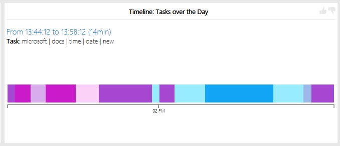

# Task Detection

## Overview

 This project uses Natural Language Processing (NLP) and Word2Vec to automatically detect task switches in real-time. This project is a feature on 
[Personal Analytics](https://pluto.ifi.uzh.ch/PersonalAnalytics/), a productivity application initiated by the University of Zurich.
This project was completed under the supervision of Dr. Gail C. Murphy, University of British Columbia, and Dr. Thomas Fritz, University of Zurich. 

The following is a screenshot of the visualization of the program:

As you hover over the timeline, it displays the time, duration and the tokens that represent the task worked on. 

## Description of Algorithm

1. Fetch the window titles used within the last two minutes
2. Reduce noise and create bag of words by tokenizing, stemming, removing stop words and non-English words
3. Remove insignificant words
4. Add it to the list of tasks:
    * If it is similar to the preceding task (using Word2Vec and cosine similarity), collapse into one task
    * Otherwise, create new task and check if this task has been worked on earlier

## Further Improvements

- Consider the duration of the windows used by the user. Add more importance to those worked on for a longer period of time
- Add a feature that allows the user to choose how many words to include for the description of each tasks
- Connect the project to a to-do list, which the user fills out. The program can then scratch items off of the list as they complete tasks throughout the day.

## Possible Applications

- Help with filling out timesheets / automatically filling out timesheets
- Automatically check off items on a to-do list based off the tasks detected
- User may analyze their productivity over the course of a day
    
